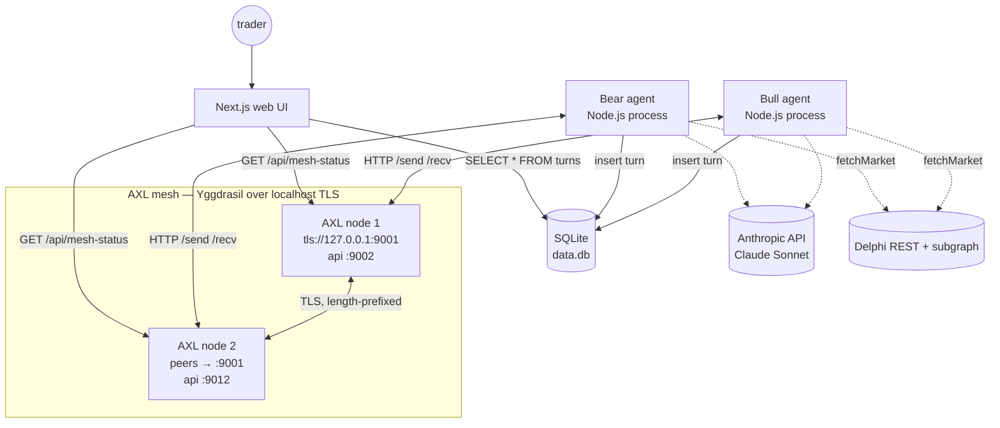

# Delphi Duel

**The second opinion engine for Delphi prediction markets.**

---

## What it does

You paste any market from [Delphi](https://app.delphi.fyi). Two AI agents debate it for you — one argues YES, one argues NO — and you read the transcript before placing your bet. The agents run in two separate processes on your laptop and talk to each other peer-to-peer over [Gensyn AXL](https://github.com/gensyn-ai/axl), not through a central server.

## How it works

- **Two AXL nodes peer on localhost.** Each is a separate Go process with its own ed25519 identity key.
- **Each agent connects to its own AXL node** via a local HTTP bridge (bull → `:9002`, bear → `:9012`).
- **Bull opens the duel.** It fetches the market from Delphi, mints a `duel_id`, calls Claude to form an opening argument, and sends the resulting JSON envelope to bear's public key via `POST /send`.
- **Bear polls `GET /recv`,** parses the message, calls Claude with bull's argument as context, and sends its rebuttal back.
- **They alternate for N rounds** (default 4), then both exit. Every turn lands in a shared SQLite file; the web UI polls SQLite for live updates.

## Architecture



The two AXL nodes are real, separate processes — different config files, different identity keys, different TCP ports. Bull's agent never imports anything from bear's directory. Every byte that crosses between the two agents is routed through the AXL mesh.

## AXL integration

The duel uses three AXL endpoints. Every byte exchanged between the agents flows through this surface — there is no direct HTTP, IPC, or file channel between bull and bear.

| Endpoint | Direction | Why we use it |
|---|---|---|
| `POST /send` | agent → its own AXL node → peer | Producer pushes a turn (JSON `TurnRecord`) to the peer's pubkey via `X-Destination-Peer-Id`. Fire-and-forget; AXL queues at the receiver. |
| `GET /recv` | agent ← its own AXL node | Consumer polls (500 ms cadence) for inbound turns. Returns `204` when empty, `200` with body + `X-From-Peer-Id` header when a message is waiting. |
| `GET /topology` | agent ← its own AXL node | Used at startup to (a) confirm the local node is up and reports the expected `our_public_key`, (b) confirm the peer is reachable (`peers[*].up == true`). Web UI polls every 5 s for the mesh status indicator. |

**Cross-node communication, not in-process.** Bull is one OS process bound to `:9002`. Bear is a separate OS process bound to `:9012`. Both shell into AXL via HTTP only. The handshake passes over Yggdrasil-style TLS on `tls://127.0.0.1:9001`. Kill bear's AXL node and bull's `/send` returns a transient 5xx; the agent retries with backoff.

**Identity verification.** `axl/keys/public-keys.json` records both each peer's full ed25519 `pubkey` (used as `X-Destination-Peer-Id` for outbound `/send`) and the AXL-derived `axl_peer_id` (a 64-char hex value the receiver sees on `X-From-Peer-Id`). The two are not equal: AXL derives the receiver-side ID from the sender's Yggdrasil IPv6, which only encodes a prefix of the pubkey. The mismatch is by design and documented in `AGENTS.md`.

## Tech stack

| Layer | Choice |
|---|---|
| Mesh transport | [Gensyn AXL](https://github.com/gensyn-ai/axl) (Go binary, two local instances) |
| Agent runtime | Node.js 20 + TypeScript, two processes |
| Orchestrator | `tsx scripts/run-duel.ts` (spawns + supervises both agents) |
| LLM | Anthropic Claude Sonnet, strict-JSON output validated with [zod](https://github.com/colinhacks/zod) |
| Market data | [`@gensyn-ai/gensyn-delphi-sdk`](https://github.com/gensyn-ai/gensyn-delphi-sdk) (REST + Goldsky subgraph, read-only) |
| Persistence | SQLite via [`better-sqlite3`](https://github.com/WiseLibs/better-sqlite3), WAL mode |
| Web UI | Next.js 14 (app router) + Tailwind + framer-motion + lucide-react |
| Identity | ed25519 keypairs (`openssl genpkey`), one per agent |
| Workspaces | pnpm |

## Run it locally

Prereqs: Node 20+, pnpm, Go 1.25+, OpenSSL 3 with ed25519 (Homebrew `openssl@3` on macOS — LibreSSL won't work).

```bash
# 1. Install deps
pnpm install

# 2. Configure secrets
#    Generate a Delphi API access key: https://api-access.delphi.fyi
#    Generate an Anthropic API key:    https://console.anthropic.com
cat > .env.local <<EOF
DELPHI_API_ACCESS_KEY=...
DELPHI_NETWORK=mainnet
ANTHROPIC_API_KEY=...
EOF

# 3. Build the AXL binary + generate two ed25519 identity keys
pnpm axl:build
pnpm axl:keys

# 4. Start the mesh (two AXL nodes, in the background)
pnpm axl:start
pnpm axl:probe        # capture both pubkeys + axl_peer_ids into axl/keys/public-keys.json

# 5. Either run a duel from the CLI...
pnpm run-duel                                                 # picks a random market
pnpm run-duel 0xc81b47c859a8b8290c3931d46562b547d283d3f4      # specific market

# ...or run the web UI
pnpm dev:web
# open http://localhost:3000

# When done:
pnpm axl:stop
```

Other useful commands:

```bash
pnpm test:mesh                # ping bull → bear over AXL (no LLM calls)
pnpm list-markets             # list open Delphi markets
pnpm fetch-market <id>        # render a single market in canonical form
pnpm dev:bull <id>            # run bull stand-alone (writes turns to data.db)
pnpm dev:bear <id>            # run bear stand-alone
```

## License

MIT — see `LICENSE`.
