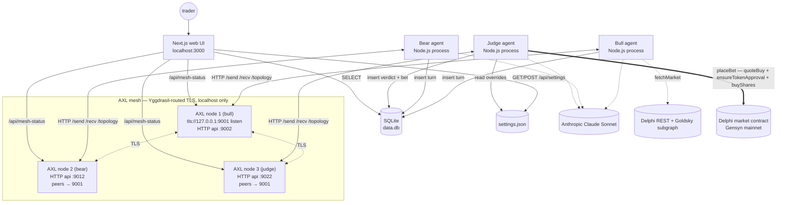

# Delphi Duel

**The full autonomous loop for Delphi prediction markets — debate, judge, bet.**

Before you bet on any Delphi market, two AI agents debate it peer-to-peer over Gensyn's AXL mesh. A third judge node reads the full debate and delivers a verdict. If confidence clears the threshold, the judge places the bet on Delphi mainnet itself — no human in the middle. **Three nodes. Two debaters. One judge. Real on-chain positions.**

[](https://ethglobal.com/)
[](https://github.com/gensyn-ai/axl)
[](LICENSE)

---

## Why this matters

- **Polymarket and Kalshi let you bet, but they don't help you think through both sides.** You see the price, the volume, and a comment thread. The thinking is your problem.
- **Delphi settles markets with AI.** The analysis going *in* should also be AI-driven — not vibes-from-Twitter and not whoever shouted last on the order book.
- **Delphi Duel forces a structured adversarial debate before you commit capital.** Two agents argue opposite sides for several rounds. A third agent — the judge — reads the full transcript and tells you what the debate actually established. You walk away with the strongest case for each side, a verdict, and — if you trust the judge enough — an open position on chain.

---

## Key features

- **Autonomous betting agent.** After the judge delivers a verdict with confidence above the threshold, it automatically places a bet on Delphi mainnet via the SDK (`quoteBuy` → `ensureTokenApproval` → `buyShares`). Configurable bet size, confidence threshold, and on/off toggle — all overridable from the dashboard's settings panel without restarting the daemon. Every attempt — placed, failed, or skipped — lands in the `bets` SQLite table with the on-chain tx hash. **First confirmed mainnet bet:** [`0x0c6d7ccb…8f75b6f7f72`](https://gensyn-mainnet.explorer.alchemy.com/tx/0x0c6d7ccbb8380db82b01a36632f609a2755ce81df32f90db3f9508f75b6f7f72) — $1 USDC on NO for the May crypto-exploit market.

- **Binary AND multi-outcome market support.** "Will X happen by Y?" works as it always did — two agents take YES/NO. For markets with three or more outcomes — *2026 NBA Champion*, *2026 FIFA World Cup Winner*, *2026 F1 Drivers' Champion* — you pick **any two outcomes** to compare head-to-head: *Argentina vs England*, *OKC vs Lakers*. The probabilities each agent reports are now `P(my outcome wins)` and don't sum to 1, because other outcomes can absorb mass. Both agents can be losing ground.

- **Three-node AXL architecture.** Bull on `api :9002`, bear on `api :9012`, judge on `api :9022`. Bull is the listener at `tls://127.0.0.1:9001`; bear and judge dial out to it. All three are independent OS processes with their own ed25519 identity keys. **No agent imports another agent's directory.** All inter-agent communication crosses the mesh.

- **Judge node.** An independent third AXL node receives the full debate transcript via `/send` after both agents produce `is_final`. It calls Claude with a verdict prompt — distinct from the debater prompts — and returns:

  - `winner`: `bull`, `bear`, or `inconclusive`
  - `confidence`: `0.0`–`1.0`
  - `reasoning`: 2–3 sentence paragraph the trader sees
  - `recommended_position`: `STRONG YES` / `MODERATE YES` / `NEUTRAL` / `MODERATE NO` / `STRONG NO`

  The judge's prompt explicitly weighs evidence quality over the agents' own confidence claims.

- **Outcome names everywhere.** In multi-outcome markets the UI shows "**ENGLAND WINS THE DEBATE**" instead of "BEAR WINS". The verdict text reads "Lakers holds at 0.39 — stronger case than OKC (0.22)" instead of "agents disagree, bull at 0.39, bear at 0.22". Real names, not role abstractions.

- **Live Delphi mainnet data.** Markets, outcomes, implied probabilities, and resolution dates are pulled live from `@gensyn-ai/gensyn-delphi-sdk` against mainnet. Subgraph trade history derives the implied probability per outcome at fetch time.

- **Dashboard settings + bets history.** The web UI exposes a gear icon for live bet-control overrides (size, threshold, on/off), a `/bets` page that joins the bets table with verdicts to render the operator's full track record, and an inline auto-bet summary on the verdict card so the dashboard tells one coherent story per duel.

---

## How it works

1. **Pick a market.** Select any open Delphi market — binary or multi-outcome head-to-head — from the dashboard or pass an ID to `pnpm run-duel`.
2. **Two agents debate.** Bull and bear take opposing sides over N rounds. Each turn — probability, confidence, reasoning, message-to-peer — is shipped peer-to-peer over the AXL mesh and persisted to SQLite.
3. **Judge delivers a verdict.** The third AXL node receives the full transcript, calls Claude with the verdict prompt, and writes `winner`, `confidence`, `recommended_position`, and a 2–3 sentence reasoning paragraph into the `verdicts` table.
4. **Judge bets.** If `AUTO_BET=true` and `confidence ≥ BET_CONFIDENCE_THRESHOLD`, the judge sizes a position and places it on Delphi mainnet automatically via the SDK. The full loop closes with no human in the middle. Every bet attempt — placed, failed, or skipped — lands in the `bets` table with its on-chain tx hash.

---

## Architecture



**Duel flow.** Bull mints a `duel_id` and opens with round 0 → bear `/recv`s, calls Claude, replies → alternate for N rounds → after both `is_final`s land, bull reads the full transcript from SQLite and ships it to judge with one `/send` → judge calls Claude with the verdict prompt, writes to SQLite → if `AUTO_BET=true` and confidence is high enough, judge submits the on-chain `buyShares` and writes the resulting tx hash back to the `bets` table.

The judge is a long-running daemon — it polls `/recv` indefinitely and processes whichever transcripts arrive. Same daemon serves multiple duels.

---

## AXL integration

The duel uses three AXL endpoints. Every byte exchanged between the agents flows through this surface — there is no direct HTTP, IPC, or file channel between bull, bear, and judge.

| Endpoint | Direction | Why |
|---|---|---|
| `POST /send` | producer → its own AXL node → peer | Bull and bear push turns (JSON `TurnRecord`) to each other's pubkey via `X-Destination-Peer-Id`. After `is_final`, bull broadcasts the assembled transcript to the judge's pubkey using the same endpoint. Fire-and-forget; AXL queues at the receiver. |
| `GET /recv` | consumer ← its own AXL node | Bear polls for inbound debate turns. Judge polls for inbound transcripts. Bull polls for the bear's response and (optionally) the judge's verdict relay. Returns `204` when empty, `200` with body + `X-From-Peer-Id` header when a message is waiting. 500 ms polling cadence. |
| `GET /topology` | each agent ← its own AXL node | Used at startup to confirm the local node reports the expected `our_public_key` (fails fast if we accidentally picked up the wrong identity key) and that the peer is reachable (`peers[*].up == true`). The web UI's mesh status indicator hits this on all three ports every 5 s. |

**Three separate processes, three ed25519 identity keys, zero direct imports between agents.** If you grep for `from "@delphi-duel/judge"` inside `agents/bull/`, `agents/bear/`, or `agents/shared/`, you'll find nothing — the only way bull learns the judge exists is by reading `axl/keys/public-keys.json` for the destination pubkey it should `/send` to.

**Identity verification.** `axl/keys/public-keys.json` records, for each of the three agents, both the full ed25519 `pubkey` (used as `X-Destination-Peer-Id` for outbound `/send`) and the AXL-derived `axl_peer_id` (a 64-char hex value the receiver sees on `X-From-Peer-Id`). The two are not equal: AXL derives the receiver-side ID from the sender's Yggdrasil IPv6, which only encodes a prefix of the pubkey. The mismatch is by design and documented in [`AGENTS.md`](AGENTS.md).

---

## Run it locally

Prereqs: Node 20+, pnpm, Go 1.25+, OpenSSL 3 with ed25519 (Homebrew `openssl@3` on macOS — LibreSSL won't work).

```bash
# 1. Install dependencies
pnpm install

# 2. Configure secrets (gitignored). See "Environment variables" below.
#    Get a Delphi mainnet API key:  https://api-access.delphi.fyi
#    Get an Anthropic API key:       https://console.anthropic.com
cp .env.example .env.local
# ...then fill in the values

# 3. Build the AXL Go binary (clones gensyn-ai/axl + make build, idempotent)
pnpm axl:build

# 4. Generate THREE ed25519 identity keys: bull.pem, bear.pem, judge.pem
#    (also writes axl/node-config-{1,2,3}.json with absolute key paths)
pnpm axl:keys

# 5. Start all three AXL nodes (bull / bear / judge) in the background
pnpm axl:start
pnpm axl:probe                # capture pubkey + axl_peer_id for all three

# 6. Run a duel from the CLI...
pnpm run-duel                                                 # picks a random market
pnpm run-duel 0xc81b47c859a8b8290c3931d46562b547d283d3f4      # specific market

# ...or run the web UI (start the judge daemon first so the verdict + bet land live)
pnpm dev:judge &
pnpm dev:web
# → http://localhost:3000

# When done:
pnpm axl:stop
```

For multi-outcome head-to-head from the CLI:

```bash
DELPHI_BULL_OUTCOME="Oklahoma City Thunder" \
DELPHI_BEAR_OUTCOME="Los Angeles Lakers" \
pnpm run-duel 0x3e43eee0ccb9ce348eb5d4d0eba29ef4a4e4572d
```

Other useful commands:

```bash
pnpm test:mesh                                  # bull → bear ping over /send + /recv (no LLM calls)
pnpm list-markets                               # browse open Delphi markets
pnpm fetch-market <id>                          # render any market in canonical Market shape
pnpm exec tsx scripts/testnet-faucet.ts         # claim 1,000 testnet USDC (Gensyn faucet)
pnpm exec tsx scripts/bridge-eth-to-gensyn-testnet.ts 0.001  # bridge 0.001 ETH from Sepolia
```

For the live-pitch run-book and demo recovery procedures, see [`DEMO.md`](DEMO.md).
For adding new specialist agents and judge-prompt contribution rules, see [`CONTRIBUTING.md`](CONTRIBUTING.md).

---

## Environment variables

Configure in `.env.local` at the repo root (gitignored). Bet-control variables (`AUTO_BET`, `BET_SIZE_USDC`, `BET_CONFIDENCE_THRESHOLD`) are also overridable from the dashboard's settings panel — those overrides win over env, env wins over defaults, defaults are the floor.

| Variable | Required | Default | Purpose |
|---|---|---|---|
| `ANTHROPIC_API_KEY` | yes | — | Anthropic API for all three agents |
| `DELPHI_API_ACCESS_KEY` | yes | — | Delphi REST + Goldsky subgraph reads |
| `DELPHI_NETWORK` | no | `mainnet` | `mainnet` or `testnet` |
| `AUTO_BET` | no | `false` | Set `true` to enable autonomous betting |
| `MAINNET_WALLET_PRIVATE_KEY` | when `AUTO_BET=true` | — | 0x-prefixed 64-char hex; funded with USDC + native gas on the chosen network |
| `BET_SIZE_USDC` | no | `1.00` | USDC per bet (human units, not wei) |
| `BET_CONFIDENCE_THRESHOLD` | no | `0.65` | Minimum verdict confidence to trigger a bet |
| `DELPHI_DUEL_TURNS` | no | `4` | Total turns across both agents |
| `DELPHI_DUEL_MODEL` | no | `claude-sonnet-4-20250514` | Claude model for all three prompts |

---

## Database

SQLite at `<repo-root>/data.db`, WAL mode for safe concurrent writes from bull / bear / judge / web.

| Table | Purpose | Key columns |
|---|---|---|
| `turns` | Every debate turn from bull and bear | `(duel_id, round)` PK; `role`, `market_id`, `champion_outcome_idx`, `probability`, `confidence`, `reasoning`, `message_to_peer`, `is_final`, `bull_outcome`, `bear_outcome`, `produced_at` |
| `verdicts` | Judge verdict per duel | `duel_id` PK; `market_id`, `winner`, `confidence`, `reasoning`, `suggested_lean`, `recommended_position`, `produced_at` |
| `bets` | Autonomous bet attempts | `duel_id` PK; `market_id`, `outcome_index`, `amount_usdc`, `tx_hash`, `status` (`placed` / `failed` / `skipped`), `error`, `timestamp` |

The `bets` table is the operator's track record. View it at [`/bets`](http://localhost:3000/bets) in the dashboard.

---

## Live demo results

Real duels run against live Delphi mainnet markets. Every value below is read directly from `data.db`; the reasoning paragraphs are verbatim from the judge agent.

### 💸 Will Microstrategy announce a Bitcoin purchase April 28–May 4? (binary, AUTO_BET live on mainnet)

**Judge verdict: Bear wins, 70% confidence, recommended position MODERATE NO.**

**Auto-bet placed: $1 USDC on NO #1, [tx 0x051130…692081](https://gensyn-mainnet.explorer.alchemy.com/tx/0x0511300c379ead9bc9c0bc28b132ea06895095295634c857545ad5a7fd692081) — CONFIRMED on Delphi mainnet.**

This is the loop closing in real time. Two agents debated, the judge produced a verdict at >0.65 confidence, and the on-chain `buyShares` settled in the next block. Total time from "duel finished" to "position open": single-digit seconds. No human in the middle of the trade.

### 🏆 2026 FIFA World Cup — Argentina vs England (multi-outcome head-to-head)

| Round | Side | Outcome | P(my outcome wins) |
|---|---|---|---|
| 0 | Bull | Argentina | 0.32 |
| 1 | Bear | England   | 0.28 |
| 2 | Bull | Argentina | 0.22 |
| 3 | Bear | England   | 0.26 |

**Judge verdict: England wins the debate, 72% confidence, recommended position MODERATE NO on Argentina.**

> Bear effectively countered Bull's system-evolution argument by highlighting the irreplaceable nature of Messi's individual impact, while Bull never adequately addressed the core aging concern that drove their own probability down from 0.32 to 0.22. Bear's point about England's steady tournament improvement trajectory versus Argentina's unprecedented challenge of replacing Messi's clutch moments proved decisive.

Both agents moved DOWN from their openings — the correct behaviour in multi-outcome mode. As bear weakened bull's case, mass flowed away from Argentina without flowing to England; other countries absorbed it.

### 🏛️ US × Iran permanent peace deal by May 31, 2026 (binary, near-term)

| Round | Side | P(YES) |
|---|---|---|
| 0 | Bull (YES) | 0.45 |
| 1 | Bear (NO)  | 0.08 |
| 2 | Bull (YES) | 0.42 |
| 3 | Bear (NO)  | 0.12 |

**Judge verdict: Bear wins, 75% confidence, recommended position MODERATE NO.**

The widest final disagreement gap of any duel run so far (0.30). Bull never recovered from bear's opening framing of "permanent peace deal" as definitionally near-impossible inside the timeline. The verdict surfaces non-trivial information beyond the market consensus — Delphi was pricing this at 39% YES at fetch time, well above what either agent ended at.

---

## Roadmap

- **Cross-machine nodes.** Bull, bear, and judge on three separate cloud VMs proving AXL across the open internet rather than just on `127.0.0.1`. Yggdrasil's mesh routing handles NAT traversal natively — the agent code shouldn't need to change. Demonstrates the "no central server" claim in a way that's hard to wave away.

- **Reputation scoring.** Per-agent accuracy by market category over time. Once enough markets resolve, score "did the duel surface the right side?" and weight verdicts on future debates by the agents' historical hit rate in that category. Subgraph integration to detect resolved markets is the unblock.

- **Bet sizing by Kelly criterion.** Replace the flat `BET_SIZE_USDC` with a position sized by Kelly: judge confidence (calibrated against historical Brier score per category) gives the edge; market price gives the implied probability; Kelly gives the optimal fraction of bankroll. Sized down by a safety multiplier (¼-Kelly is standard). A daily loss budget is enforced before any bet hits the wire.

---

## Tech stack

| Layer | Choice |
|---|---|
| Mesh | [Gensyn AXL](https://github.com/gensyn-ai/axl) Go binary, three nodes, ed25519 keypairs |
| Agents | Node.js 20 + TypeScript, three separate processes |
| AI | Anthropic API, `claude-sonnet-4-20250514`, strict-JSON output validated with [zod](https://github.com/colinhacks/zod) |
| Market data | [`@gensyn-ai/gensyn-delphi-sdk`](https://github.com/gensyn-ai/gensyn-delphi-sdk), read + write on Gensyn mainnet/testnet |
| On-chain | [viem](https://viem.sh) for the OP-stack canonical bridge + faucet helpers in `scripts/` |
| Frontend | Next.js 14 (app router), Tailwind, shadcn/ui patterns, [framer-motion](https://www.framer.com/motion/), [lucide-react](https://lucide.dev) |
| Database | SQLite via [`better-sqlite3`](https://github.com/WiseLibs/better-sqlite3), WAL mode for cross-process writes |
| Orchestrator | `pnpm run-duel` — single command, full flow including mesh readiness check + verdict |
| Workspaces | pnpm |

---

## Built by

**Moren** ([@Moren808](https://github.com/Moren808)) — solo, four days, ETHGlobal Open Agents 2026.

## License

MIT — see [`LICENSE`](LICENSE).
